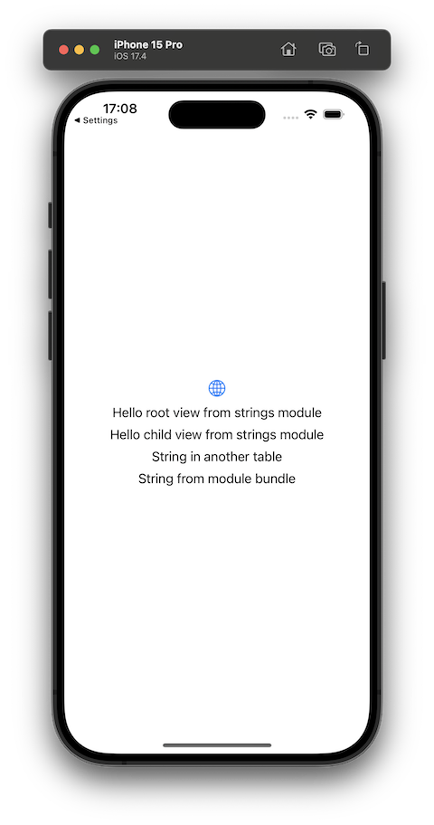

#  StringCatalogToy

This is a toy project to show various scenarios of working with string catalogs in a project that contains a top-level app target and some Swift Package modules.

[See the blog post](https://jaanus.com/swift-string-catalogs/) for more info.

